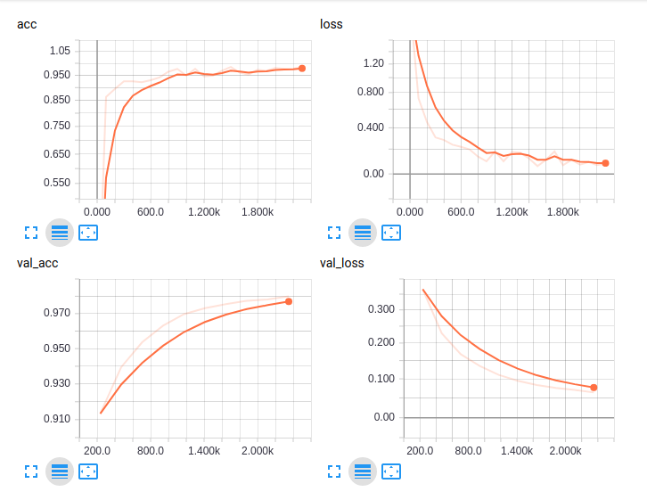

# deep-learning-jhu-cs-482-682

## Names

1. **Praateek Mahajan**
    - pmahaja2@jhu.edu
2. **Nitin Kumar**
    - nkumar14@jhu.edu
3. **Anant Bhargava**
    - abharga7@jhu.edu

# Answers

### Varying Datasets (3 points)

1. Compare the performance of mnist and fashion-mnist

- **Blue is fMNIST**
- **Orange is MNIST**

MNIST reaches 97.27% validation accuracy whereas with the same settings Fashion MNIST reaches only 82.07%. This suggests that FMNIST is a more complex dataset than MNIST. Further confirming our point, the difference between training accuracies is close to the difference in validation accuracies (94.14% MNIST vs 79.69% fMNIST), which means the error is not coming from overfitting to the more complex dataset (not from variance), but our model's lack of flexibility for more complex data (from bias).

### Varying Hyperparameters (3 points each)

2. Train for twice as many epochs for both mnist and fashion_mnist.
    - [Fashion 10 epochs, MNIST 10 epochs, Fashion 20 epochs, MNIST 20 epochs]
    - How is this similar and different previous runs?

- **Blue is fMNIST**
- **Orange is MNIST**

We see that if we run for more epochs the validation accuracy of MNIST reaches 98.32% (increase of 1%) and that of FMNIST reaches 85.37% (increase of 3%). The training accuracy of MNIST reaches 96.48% and of fMNIST reaches 83.59%, also showing increase. The loss also continues to decrease. This shows that our model hadn't converged yet (and might not have now) and that more training could help our model.

3. Change the SGD Learning Rate by a factor of
    - [0.1x, 1x, 10x]

- **Pink is LR 10x**
- **Green is LR 1x**
- **Gray is LR 0.1x**

We see with a learning rate of 0.1x the decrease in loss happens slowly, whereas for with a learning rate of 10x it happens faster than 1x. Learning rate of 10x seems to be a better learning rate our accuracy touhces 87% compared to 1x where it only reaches 81%. Thus 10x learning rate helps us with faster convergence.

4. Compare Optimizers
    - [SGD, Adam, Rmsprop]

- **Blue is Adam**
- **Orange is SGD**
- **Red is Rmsprop**

RMSProp and SGD perform similarly. Adam outperforms both the other optimizers, since it also keeps record of exponentially decaying gradients average of past gradients, apart from storing just the exponentialy decaying average of past squared gradients. Adam reaches an accuracy of 88% compared to 83% and 82% for RMSProp and SGD respectively.

5. Set the dropout layer to a dropout rate of
    - [0, 0.25, 0.5, 0.9, 1]

- **Blue is 0**
- **Blue is 0.25 (Tensorboard set both to the same color)**
- **Pink is 0.5**
- **Green is 0.9**
- **Gray is 1**

As we can expect a dropout of 1 means that a layer is always disabled, thus with a dropout of 1 our network performs as bad as a random classifier, with no decrease in loss.
We expect similar performance from a dropout rate of 0.9 where it will take much more epochs to learn anything substantial.
We observe that among 0.25 and 0.5 of dropout 82% and 80% respectively. With more epochs we can expect them to perform similarly. 

Also with higher dropout rates we observe similar accuracy on train and validation both, confirming that we are not overfitting.

6. Change the batch size by a factor of:
     - [1/8x, 1x, 8x]

- **Grey is 1/8x Batch Size**
- **Orange is the default Batch Size**
- **Blue is 8x**

With a batch size of 8x we observe that our loss decreases sub-linearly, this indicates that our weight updates with respect to our gradients are much more informed compared to batch size of 1x or 1/8x, where the decrease is gradual. However with a batch size of 1/8x it means we are performing 8 times more updates to our weights, which leads to a faster convergence as our accuracy achieved is 88%. Whereas for a batch size of 1x and 1/8x our accuracies are 82% and 72% respectively. Running the latter batch sizes for longer epochs might lead to similar performance.

7. Change the number of output channels in each convolution and the first Linear layer.
    - [0.5x, 1x, 2x]
    - Note: The input values of each layer will need to match the previous layer.
    - You'll need to implement `P2Q7HalfChannelsNet` and `P2Q7DoubleChannelsNet`.

- **Blue is half the channels**
- **Pink is default the channels**
- **Green is double the channels**

Here we have similar performance when our channels are 1x and 2x, with a performance of 82.05% and 82.92% accuracy. This indicates extracting more information from our linear layer will help us only marginally, although we may see this difference increase with more epochs. However with half as many channels our model gives 79% accuracy. This can be attributed to the fact that not enough information is being extracted from our input layers.

8. Add a Batch Normalization Layer after the first convolution.

- **Red is after adding batchnormalization**

Adding batchnormalization improved performance, by preventing overfitting (imposing regularisation). We may see further effects with more epochs

9. Add a Dropout layer immediately after the Batch Normalization from the previous question.

Adding a dropout layer after batch norm reduced the performance. This could be attributed to slower learning due to dropout. However running for more epochs might help reducing overfitting.

10. Move the Batch Normalizaton layer just below the Dropout layer from the previous question.
    - Compare 9 with 10 and explain what happened.
    - You may want to do a quick search of the current literature for this one.

Swapping position of dropout layer hurt the performance. The paper by (Li. et al)[https://arxiv.org/abs/1801.05134] explains the effect of having dropout before BN. 

From our understanding, we say that dropout shifts the variance of neural units when moving from train to test. Whereas BN maintains this statistical variance. This inconsistency of variance causes unstable behaviour in inference that leads to degraded performane. If we dropout some units before BN it would result in a different calculation of the mean and variance, whereas during test time we would have all units present. Hence it is safe to say that dropout after BN is preferred over dropout before BN.

11. Add one extra Conv2D layer

We added the extra Conv2D layer after our second convolution layer, thus expanding from 20 to 30 channels. We didn't use max pool. This deteriorated our performance with default settings. This is not abnormal, since we have a more complex model, and the number of epochs is the same as the less complex model. However we observe that loss is continuously decreasing, therefore training on more epochs would definitely help our case. 

12. Remove a layer of your choice
    - In addition to the standard questions, what did you choose and why?

We removed the FC2 from the model. Since we are dealing with images, removing a convolution would result in losing the shift invariance. Secondly, removing a fully connected layer also reduces the number of parameters significantly. So now our FC1 is of dimension **320 x 10**. 

This resulted in similar performance (84% on valdidation) and also the model was much faster to train. 
 
### Become the ultimate Fashion-MNIST model (25 points)

13. Create the best model you can on Fashion-MNIST based on your experience from the previous questions.
    - A minimum of 92% validation accuracy is required for full credit.
    - Make sure to save your best model checkpoints or you'll be out of luck.
    - Feel free to use outside literature
    - Please write your own code
    - Also answer the following questions
        1. What does each change do mathematically?
        2. What does each change do algorithmically?
        3. How and why does the loss, accuracy, validation loss, and validation accuracy change?
        4. How and why does the training time change? (if at all)
        5. Explain why you would want to apply such a change to your model.
    - The best performer in the class will get a prize!

We observed that batch normalization had improved performance from question 8. We started off with using the structure from previous questions with two convolutional layered neural networks along with maxpooling in between, this resulted in about 86% accuracy. Max pooling is used to decrease the dimensionality but it loses information by only choosing the maximum in the area. Simplicity the all convolutional net by Springenberg et al.[https://arxiv.org/pdf/1412.6806.pdf] made us think about using convolutional layers with stride instead of normal maxpooling layers. So we used a very simple architecture with a single convolutional layer as before and then did another layer of convolution but with stride of 2 to reduce the dimensionality of the data to 128. This was then fed into another linear layer which converted into 10 dimensional vector. Log softmax was applied to the last layer. 

Diagram of the CNN:

Experimentation was done to change the number of channels and this particular configuration was  the first one where we crossed the 92% threshold.  Larger number  of output channels resulted in longer train times because  of more nunber  of parameters. 

Discussion of accuracy, loss, val\_loss, val\_acc:

Early stopping was done after 8 epochs, as the loss tapers off and the validation accuracy increases to 92%. 
The train accruacy increases  and tapers off near 95%. The training loss also decreases and tapers off near 0.1. The validation loss increases after 1.75k, so model at this epoch was chosen and saved, as it would be the point where the generalization loss would be  the least. After this point the validation loss increases again to around 0.250. These graphs make sense as after certain training epochs the training accuracy tapers off and the training loss stabilizes. After a certain time the validation loss increases indicating overfitting. 

Training time changes with the number of layers,  and the number of parameters. We found that decreasing the number of parameters decreased the training time. 

### Fine tuning between datasets (3 points each)

14. Evaluate your "ultimate Fashion-MNIST model" by loading the trained weights and running on MNIST without changing the Fashion-MNIST weights at all.

After running trained weights that got a validation accuracy of over 92%, we receive a validation accuracy of 9.86%. This makes sense as it is approximately 10%, approximately random chance. The weights have been trained on an entirely different dataset, and have no reason to cross over.

15. Reduce your SGD learning rate by 20x, and train MNIST on your ultimate Fashion-MNIST model
     - Compare this to your original MNIST training run and the previous question

We saw after 1 epoch we reached 91% validation accuracy and 98% after 10 epochs. We start with much higher accuracy likely because our model is significantly more robust to overfitting and faster at classifying a more complex model.
